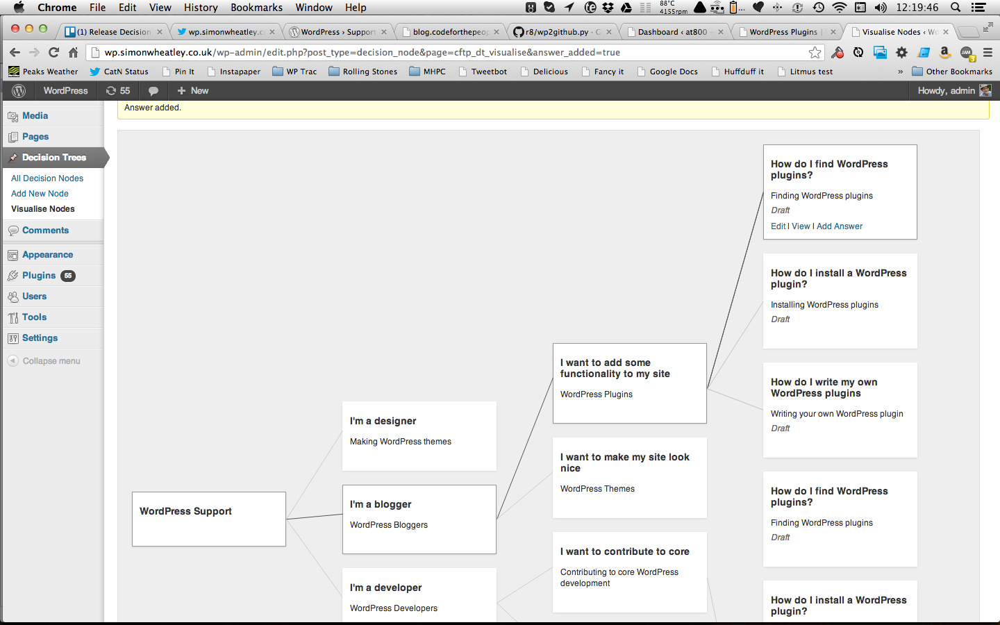
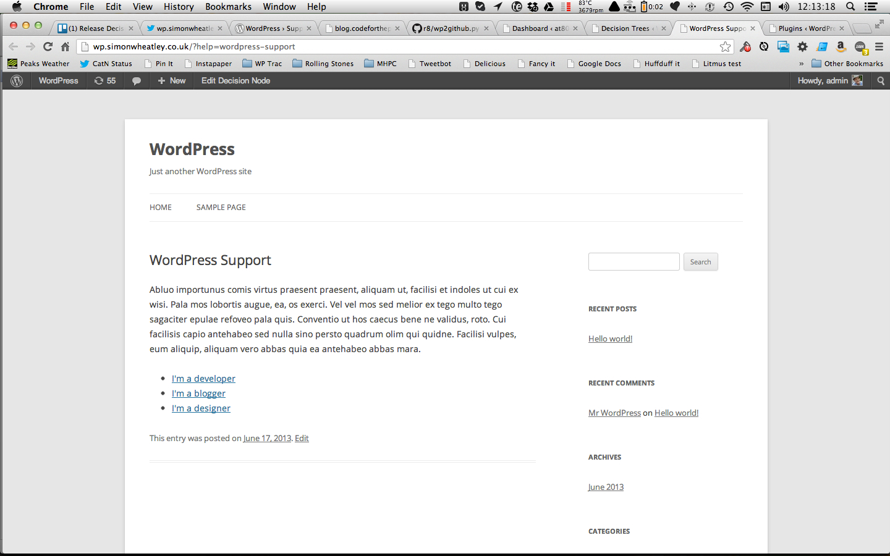
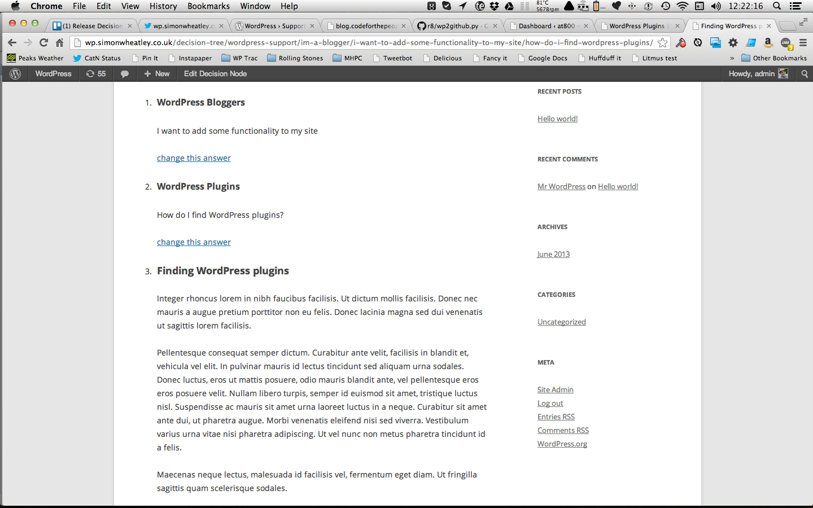

# Decision Trees

* Contributors: codeforthepeople, simonwheatley
* Tested up to: 3.5.1
* Stable tag: 1.2
* Requires at least: 3.5.1

Provides a custom post type to create decision trees in WordPress.

## Description

The plugin comes with the ability to add simple links from a decision node to the possible answers you can give to that node, e.g. the node might ask "How many legs does it have?" then provide links to "it has two legs", "it has four legs", "it has six legs", etc.

It is possible to extend the plugin to provide range based answers, meaning you could ask a user to type in a date or length in cm, and then calculate the decision node which correctly answers this dynamically./Users/simon/Scripts/wp2github/wp2github/wp2github.py --source readme.txt --target readme.md

## Installation
1. Download and unzip the plugin.
2. Copy the decision-trees directory into your plugins folder.
3. Visit your Plugins page and activate the plugin.

## Screenshots

*Visualising your decision tree in the admin area*

*A decision node with some answer links*

*A decision node showing the two preceding answers and the link to change them*

## Changelog

### 1.2 

* Displays history above the current node content.

### 1.1 

* Allows construction of basic decision tree with simple answers
* Outputs answers

### 1.0 

* Work in progress

